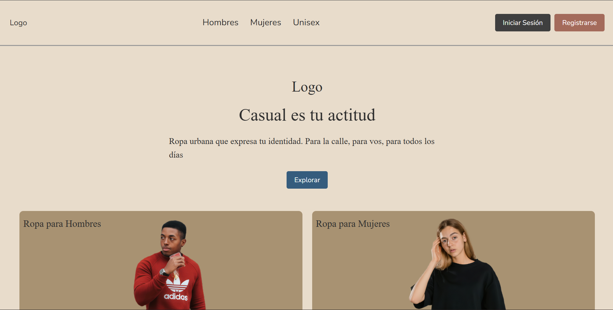
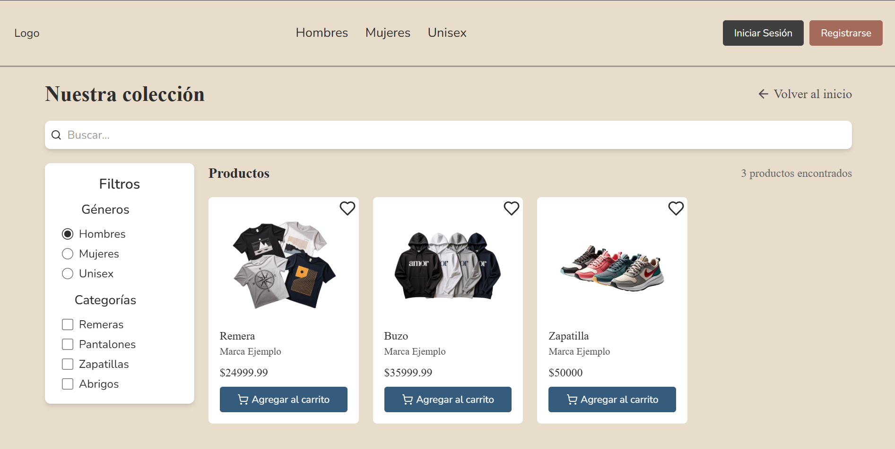
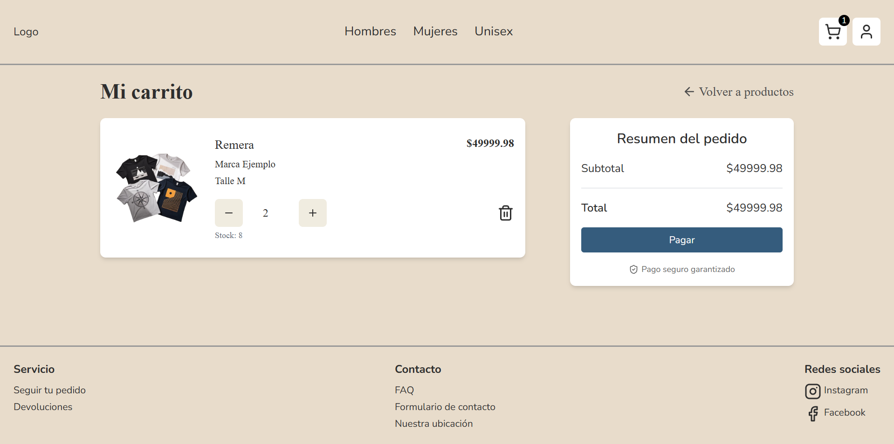
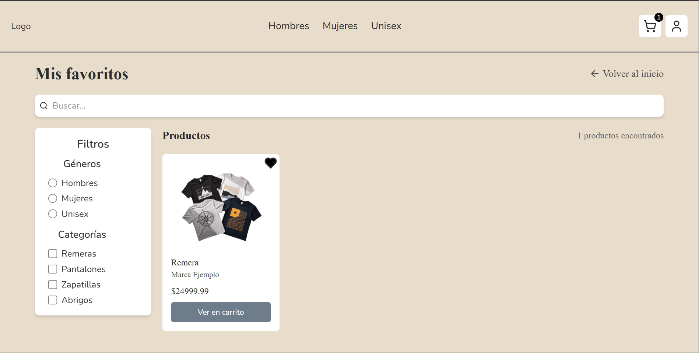
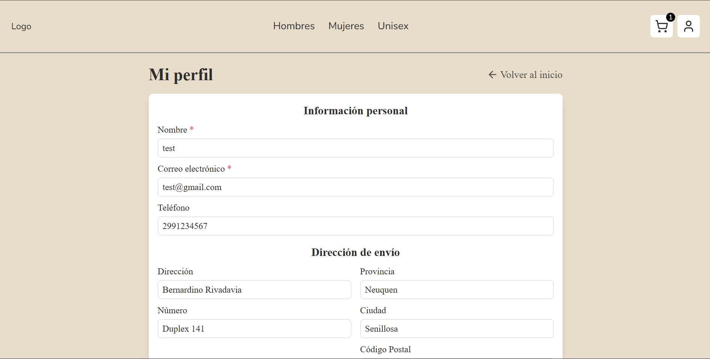
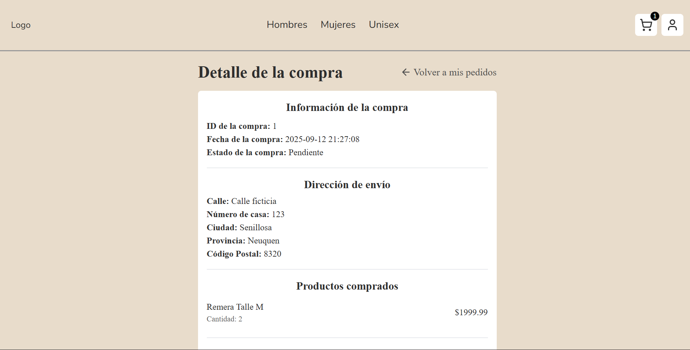

<a id="readme-top"></a>


<!-- TABLE PF CONTENTS -->
<details>
  <summary>Table of Contents</summary>
  <ol>
    <li>
      <a href="#about-the-project">About The Project</a>
      <ul>
        <li><a href="#demo">Demo</a></li>
        <li><a href="#built-with">Built With</a></li>
        <li><a href="#features">Features</a></li>
        <li><a href="#future-features">Future features</a></li>
        <li><a href="#project-goals">Project goals</a></li>
      </ul>
    </li>
    <li>
      <a href="#getting-started">Getting Started</a>
      <ul>
        <li><a href="#installation">Installation</a></li>
      </ul>
    </li>
    <li><a href="#contact">Contact</a></li>
    <li><a href="#acknowledgments">Acknowledgments</a></li>
  </ol>
</details>

## About The Project

Clothing Store Frontend is a modern e-commerce user interface built with Vue 3 + Vite, designed to deliver a smooth, responsive, and engaging shopping experience.
This project is part of my portfolio and showcases my focus on usability, scalability, and clean design.



### Demo

You can explore de admin section using these credentials:
* Email: test@gmail.com
* Passsword: test1234

[Go to deployed website](https://clothing-store-frontend-mocha.vercel.app)

### Built With

| Technology | Version | Description |
|------------|---------|-------------|
| **Vue 3** | ~3.x | Frontend framework used for user interface development |
| **Vite** | ~4.x | Bundler |
| **JavaScript (ES6+)** | — | Logic, components |
| **Tailwind** | ~4.x | Styles / responsive design |
| **Hosting** | Vercel | Free hosting |

### Structure

```text
Clothing_Store_Frontend/
├── public/                # public static files
├── src/
│   ├── api/               # api requests handlers
│   ├── assets/            # images, fonts, etc.
│   ├── components/        # reusable components
│   ├── consts/            # useful consts 
│   ├── views/             # views
│   ├── router/            # routes
│   ├── store/             # global states with Pinia
│   ├── styles/            # css files
│   └── utils/             # useful and reusable logic
├── .gitignore
├── index.html
├── package.json
├── vite.config.js
├── vitest.config.js
└── README.md
```
### Features

#### User

* Product catalog with search and filters

* Functional cart

* Favorite products list

* Editable profile

* Order tracking


#### Admin

* Admin panel with pagination
* 

#### System

* Backend integration
* Authentication
* Responsive design for mobile, tablets and desktop

### Future features

* UX / UI improvements
* FAQ and contacts page
* Implement payment gateway integration
* Advanced analytics dashboard
* Dark/Light mode toggle

### Project goals

* Creating a frontend that is visually appealing, functional, and ready for real-world integration.
* Demonstrate frontend development skills for scalable web applications.
* Apply clean code practices and modular architecture.

<p align="right">(<a href="#readme-top">back to top</a>)</p>

<!-- GETTING STARTED -->
## Getting Started
To get a local copy up and running follow these simple example steps.

### Installation

1. Clone the repo
   ```sh
   git clone https://github.com/alexiscruz1403/Clothing_Store_Frontend.git
   ```
2. Go to the created folder
   ```sh
   cd Clothing_Store_Frontend
   ```
3. Install dependencies
   ```sh
   npm install
   ```
4. Run local development server
   ```sh
   npm run dev
   ```
<p align="right">(<a href="#readme-top">back to top</a>)</p>

<!-- CONTACT -->
## Contact

Jesús Ramón Alexis Cruz - [LinkedIn](www.linkedin.com/in/jr-alexis-cruz) - jr.alexis.cruz.2003@gmail.com

<p align="right">(<a href="#readme-top">back to top</a>)</p>

## License 

This project is licensed under the terms of the [MIT License](./LICENSE).  
You are free to use, modify, and distribute this project, provided that proper credit is given.

<p align="right">(<a href="#readme-top">back to top</a>)</p>

<!-- ACKNOWLEDGMENTS -->
## Acknowledgments

* [Vue 3](https://vuejs.org/)
* [Vite](https://vitejs.dev)
* [Tailwind](https://tailwindcss.com/)
* [Lucide Icons](https://lucide.dev/icons/)
* [Google Fonts](https://fonts.google.com/)

<p align="right">(<a href="#readme-top">back to top</a>)</p>
